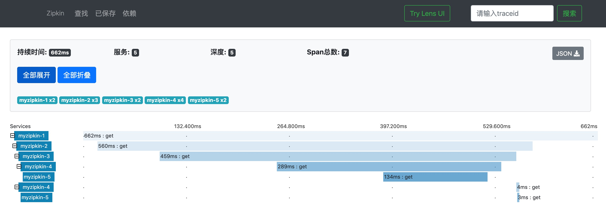
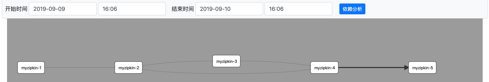

# Zipkin 简介

> [Zipkin](https://zipkin.io/) is a distributed tracing system. It helps gather timing data needed to troubleshoot latency problems in service architectures. Features include both the collection and lookup of this data.
>
> If you have a trace ID in a log file, you can jump directly to it. Otherwise, you can query based on attributes such as service, operation name, tags and duration. Some interesting data will be summarized for you, such as the percentage of time spent in a service, and whether or not operations failed.
>
> Application’s need to be “instrumented” to report trace data to Zipkin. This usually means configuration of a tracer or instrumentation library. The most popular ways to report data to Zipkin are via http or Kafka, though many other options exist, such as Apache ActiveMQ, gRPC and RabbitMQ. The data served to the UI is stored in-memory, or persistently with a supported backend such as Apache Cassandra or Elasticsearch.

Zipkin是一种分布式跟踪系统。 它有助于收集解决服务体系结构中的延迟问题所需的计时数据。 功能包括收集和查找此数据。

Zipkin是Twitter基于google的分布式监控系统Dapper（论文）的开发源实现，zipkin用于跟踪分布式服务之间的应用数据链路，分析处理延时，帮助我们改进系统的性能和定位故障。[Dapper论文地址](https://links.jianshu.com/go?to=http%3A%2F%2Fbigbully.github.io%2FDapper-translation%2F)

如果日志文件中有跟踪ID，则可以直接跳转到该文件。 否则，你可以根据服务，操作名称，tag标签和持续时间等属性进行查询。 将为您总结一些有趣的数据，例如在服务中花费的时间占比，以及操作是否失败。

应用程序需要“检测”以向Zipkin报告跟踪数据。 这通常意味着配置跟踪器或检测库。 向Zipkin报告数据的最常用方法是通过http或Kafka，尽管存在许多其他选项，例如Apache ActiveMQ，gRPC和RabbitMQ。 提供给UI的数据存储在内存中，或者持久存储在受支持的后端（如Apache Cassandra或Elasticsearch）中。

本示例中是使用Zipkin中集成的http组件进行发送Span数据。

# Springboot 集成 Zipkin

## 安装启动 zipkin

https://github.com/openzipkin/zipkin 中下载 zipkin.jar

```
java -jar zipkin.jar
```


## 版本说明

| 框架组件   | Version       |
| ---------- | ------------- |
| springboot | 2.1.6.RELEASE |
| zipkin     | 3.9.0         |


## 项目结构

项目采用父工程集成多模块的方式构建而成，`demo-zipkin` 父工程聚合了`zipkin-1`、`zipkin-2`、`zipkin-3`、`zipkin-4`、`zipkin-5`  五个 Module。

```
demo-zipkin
	zipkin-1
		|-SpanCollectorConfig
		|-application.properties
		|-ZipkinController
		|-Application1
	zipkin-2
		|-SpanCollectorConfig
		|-application.properties
		|-ZipkinController2
		|-Application1
	zipkin-3
		|-SpanCollectorConfig
		|-application.properties
		|-ZipkinController3
		|-Application1
	zipkin-4
		|-SpanCollectorConfig
		|-application.properties
		|-ZipkinController4
		|-Application1
	zipkin-5
		|-SpanCollectorConfig
		|-application.properties
		|-ZipkinController5
		|-Application1
```


## 工程端口分配

每个 Module 使用不同的端口，分别启动自己的Application。

| Module名称 | 端口 | Application  |
| ---------- | ---- | ------------ |
| zipkin-1   | 8081 | Application1 |
| zipkin-2   | 8082 | Application2 |
| zipkin-3   | 8083 | Application3 |
| zipkin-4   | 8084 | Application4 |
| zipkin-5   | 8085 | Application5 |


## 引入 Maven 依赖

```xml
<properties>
  <zipkin.version>3.9.0</zipkin.version>
</properties>

<!-- Springboot 相关 -->
<dependency>
  <groupId>org.springframework.boot</groupId>
  <artifactId>spring-boot-starter-web</artifactId>
</dependency>
<dependency>
  <groupId>org.springframework.boot</groupId>
  <artifactId>spring-boot-starter-test</artifactId>
  <scope>test</scope>
</dependency>

<!-- zipkin相关 -->
<dependency>
  <groupId>org.springframework.boot</groupId>
  <artifactId>spring-boot-starter-web</artifactId>
</dependency>
<dependency>
  <groupId>io.zipkin.brave</groupId>
  <artifactId>brave-core</artifactId>
  <version>${zipkin.version}</version>
</dependency>
<dependency>
  <groupId>io.zipkin.brave</groupId>
  <artifactId>brave-spancollector-http</artifactId>
  <version>${zipkin.version}</version>
</dependency>
<dependency>
  <groupId>io.zipkin.brave</groupId>
  <artifactId>brave-web-servlet-filter</artifactId>
  <version>${zipkin.version}</version>
</dependency>
<dependency>
  <groupId>io.zipkin.brave</groupId>
  <artifactId>brave-apache-http-interceptors</artifactId>
  <version>${zipkin.version}</version>
</dependency>
<dependency>
  <groupId>io.zipkin.brave</groupId>
  <artifactId>brave-okhttp</artifactId>
  <version>${zipkin.version}</version>
</dependency>
```


## 配置文件、收集器的设置

配置 application.properties，以 `zipkin-1` 为例，其他工程中配置时将 `zipkin.serviceName`与`server.port`更改为 `myzipkin-2 …`与`8081...`等即可

```properties
zipkin.serviceName=myzipkin-1
zipkin.url=http://localhost:9411
zipkin.connectTimeout=6000
zipkin.readTimeout=6000
zipkin.flushInterval=1
zipkin.compressionEnabled=true
zipkin.samplerRate=1

server.port=8081
server.servlet.context-path=/
```


配置**Span收集器**

设置收集器的详细参数，包含超时时间、上传span间隔、以及配置采集率等，进而对收集器进行初始化。

```java
package com.anqi.zipkin.bean;

import com.github.kristofa.brave.Brave;
import com.github.kristofa.brave.Brave.Builder;
import com.github.kristofa.brave.EmptySpanCollectorMetricsHandler;
import com.github.kristofa.brave.Sampler;
import com.github.kristofa.brave.SpanCollector;
import com.github.kristofa.brave.http.DefaultSpanNameProvider;
import com.github.kristofa.brave.http.HttpSpanCollector;
import com.github.kristofa.brave.http.HttpSpanCollector.Config;
import com.github.kristofa.brave.okhttp.BraveOkHttpRequestResponseInterceptor;
import com.github.kristofa.brave.servlet.BraveServletFilter;
import okhttp3.OkHttpClient;
import org.springframework.beans.factory.annotation.Value;
import org.springframework.context.annotation.Bean;
import org.springframework.context.annotation.Configuration;

@Configuration
public class SpanCollectorConfig {

    @Value("${zipkin.url}")
    private String url;

    @Value("${zipkin.serviceName}")
    private String serviceName;

    /*
        连接超时时间
     */
    @Value("${zipkin.connectTimeout}")
    private int connecTimeout;

    /*
        是否启动压缩
     */
    @Value("${zipkin.compressionEnabled}")
    private boolean compressionEnabled;

    /*
        上传 span 的间隔时间
     */
    @Value("${zipkin.flushInterval}")
    private int flushInterval;

    /*
        读取超时时间
     */
    @Value("${zipkin.readTimeout}")
    private int readTimeout;

    @Value("${zipkin.samplerRate}")
    private float samplerRate;

    /**
     * 配置 span 收集器
     * @return
     */
    @Bean
    public SpanCollector spanCollector() {
        Config config = Config.builder()
                .connectTimeout(connecTimeout)
                .compressionEnabled(compressionEnabled)
                .flushInterval(flushInterval)
                .readTimeout(readTimeout)
                .build();

        return HttpSpanCollector.create(url, config, new EmptySpanCollectorMetricsHandler());
    }

    /**
     * 配置采集率
     * @param spanCollector
     * @return
     */
    @Bean
    public Brave brave(SpanCollector spanCollector) {
        Builder builder = new Builder(serviceName);
        builder.spanCollector(spanCollector)
                .traceSampler(Sampler.create(samplerRate))
                .build();
        return builder.build();
    }

    /**
     * @Description: 设置server的（服务端收到请求和服务端完成处理，并将结果发送给客户端）过滤器
     * @Param:
     * @return: 过滤器
     */
    @Bean
    public BraveServletFilter braveServletFilter(Brave brave) {
        BraveServletFilter filter = new BraveServletFilter(brave.serverRequestInterceptor(),
                brave.serverResponseInterceptor(), new DefaultSpanNameProvider());
        return filter;
    }

    /**
     * @Description: 设置client的 rs和cs的拦截器
     * @Param:
     * @return: OkHttpClient 返回请求实例
     */
    @Bean
    public OkHttpClient okHttpClient(Brave brave) {
        OkHttpClient httpClient = new OkHttpClient.Builder()
                .addInterceptor(new BraveOkHttpRequestResponseInterceptor(
                        brave.clientRequestInterceptor(),
                        brave.clientResponseInterceptor(),
                        new DefaultSpanNameProvider())).build();
        return httpClient;
    }
}
```


## 编写 Controller 发送请求进行测试

Zipkin-1中的Controller

```java
package com.anqi.zipkin.controller;

import okhttp3.OkHttpClient;
import okhttp3.Request;
import okhttp3.Response;
import org.springframework.beans.factory.annotation.Autowired;
import org.springframework.web.bind.annotation.GetMapping;
import org.springframework.web.bind.annotation.RequestMapping;
import org.springframework.web.bind.annotation.RestController;

@RestController
@RequestMapping("zipkin")
public class ZipkinController {

    public static final String url = "http://localhost:8082/zipkin/service2";

    @Autowired
    OkHttpClient client;


    @GetMapping("/service1")
    public String service() {
        Request request = new Request.Builder().url(url).build();
        Response response;
        try {
            response = client.newCall(request).execute();
            return response.body().string();

        } catch (Exception e) {
            e.printStackTrace();
        }
        return "null";
    }
}
```

Zipkin-2中的Controller

```java
package com.anqi.zipkin.controller;

import okhttp3.OkHttpClient;
import okhttp3.Request;
import okhttp3.Response;
import org.springframework.beans.factory.annotation.Autowired;
import org.springframework.web.bind.annotation.GetMapping;
import org.springframework.web.bind.annotation.RequestMapping;
import org.springframework.web.bind.annotation.RestController;
@RestController
@RequestMapping("zipkin")
public class ZipkinController2 {
    public static final String url = "http://localhost:8083/zipkin/service3";
    public static final String url2 = "http://localhost:8084/zipkin/service4";

    @Autowired
    OkHttpClient client;

    @GetMapping("/service2")
    public String service() throws Exception {
        System.out.println("loading-----");
        Request request1 = new Request.Builder().url(url).build();
        Request request2 = new Request.Builder().url(url2).build();

        Response response1 = client.newCall(request1).execute();
        Response response2 = client.newCall(request2).execute();
        return "con2 + "+ response1.body().string() + "-" + response2.body().string();
    }
}
```

Zipkin-3中的Controller

```java
package com.anqi.zipkin.controller;

import okhttp3.OkHttpClient;
import okhttp3.Request;
import okhttp3.Response;
import org.springframework.beans.factory.annotation.Autowired;
import org.springframework.web.bind.annotation.GetMapping;
import org.springframework.web.bind.annotation.RequestMapping;
import org.springframework.web.bind.annotation.RestController;

@RestController
@RequestMapping("zipkin")
public class ZipkinController3 {
    public static final String url = "http://localhost:8084/zipkin/service4";

    @Autowired
    OkHttpClient client;

    @GetMapping("/service3")
    public String service() throws Exception {
        Request request = new Request.Builder().url(url).build();
        Response response = client.newCall(request).execute();
        return "con3 + "+ response.body().string();
    }
}
```

Zipkin-4中的Controller

```java
package com.anqi.zipkin.controller;

import okhttp3.OkHttpClient;
import okhttp3.Request;
import okhttp3.Response;
import org.springframework.beans.factory.annotation.Autowired;
import org.springframework.web.bind.annotation.GetMapping;
import org.springframework.web.bind.annotation.RequestMapping;
import org.springframework.web.bind.annotation.RestController;

@RestController
@RequestMapping("zipkin")
public class ZipkinController4 {
    public static final String url = "http://localhost:8085/zipkin/service5";

    @Autowired
    OkHttpClient client;

    @GetMapping("/service4")
    public String service() throws Exception {
        Request request = new Request.Builder().url(url).build();
        Response response = client.newCall(request).execute();
        return "con4 + "+ response.body().string();
    }
}
```

Zipkin-5中的Controller

```java
package com.anqi.zipkin.controller;

import org.springframework.web.bind.annotation.GetMapping;
import org.springframework.web.bind.annotation.RequestMapping;
import org.springframework.web.bind.annotation.RestController;

@RestController
@RequestMapping("zipkin")
public class ZipkinController5 {

    @GetMapping("/service5")
    public String service() throws Exception {

        return "service5 -----";
    }
}
```


## Springboot 启动类

```java
package com.anqi.zipkin;

import org.springframework.boot.SpringApplication;
import org.springframework.boot.autoconfigure.SpringBootApplication;

@SpringBootApplication
public class Application1 {
    public static void main(String[] args) {
        SpringApplication.run(Application1.class);
    }
}
```


## 运行分析

在地址栏请求url`http://localhost:8081/zipkin/service1`，然后访问`http://localhost:9411/zipkin/`

查看服务调用耗时



查看服务依赖关系




# 核心概念

通过上图可以了解到共有7个`span`，分别为

```json
{
	"zipkin-1":["Server Start", "Server Finish"]，
  "myzipkin-1,myzipkin-2":
  		["Client Start", "Server Start", "Client Finish", "Server Finish"],
	"myzipkin-2,myzipkin-3":
			["Client Start", "Server Start", "Client Finish", "Server Finish"],
  "myzipkin-3,myzipkin-4":
			["Client Start", "Server Start", "Client Finish", "Server Finish"],
	"myzipkin-4,myzipkin-5":
			["Client Start", "Server Start", "Client Finish", "Server Finish"],
  "myzipkin-2,myzipkin-4":
			["Client Start", "Server Start", "Client Finish", "Server Finish"],
	"myzipkin-4,myzipkin-5":
			["Client Start", "Server Start", "Client Finish", "Server Finish"],
}
```

在json文件中选取两个子集进行分析

+ 基本数据：用于跟踪树中节点的关联和界面展示，包括traceId、spanId、parentId、name、timestamp和duration，其中parentId为null的Span将成为跟踪树的根节点来展示，当然它也是调用链的起点，为了节省一次spanId的创建开销，让顶级Span变得更明显，顶级Span中spanId将会和traceId相同。timestamp用于记录调用的起始时间，而duration表示此次调用的总耗时，所以timestamp+duration将表示成调用的结束时间，而duration在跟踪树中将表示成该Span的时间条的长度。需要注意的是，这里的name用于在跟踪树节点的时间条上展示。
+ traceId：标记一次请求的跟踪，**相关的Spans都有相同的traceId。**
+ kind ：zipkin最新V2版本的API中，不再要求在annotations中上传cs,cr,sr,ss。而是通过kind标记是server-side span还是client-side span，两端记录自己的timestap来取代cs和sr，记录duration来取代cr和ss

```json
  {
    "traceId": "867a9e3867736b17",
    "parentId": "96f19423db38c90d",
    "id": "6c9fd521b6589b7f",
    "kind": "SERVER",
    "name": "get",
    "timestamp": 1568103422569000,
    "duration": 6000,
    "localEndpoint": {
      "serviceName": "myzipkin-4",
      "ipv4": "192.168.1.160"
    },
    "tags": {
      "http.status_code": "200",
      "http.url": "/zipkin/service4"
    }
  },
  {
    "traceId": "867a9e3867736b17",
    "parentId": "867a9e3867736b17",
    "id": "96f19423db38c90d",
    "kind": "CLIENT",
    "name": "get",
    "timestamp": 1568103422447000,
    "duration": 139000,
    "localEndpoint": {
      "serviceName": "myzipkin-1",
      "ipv4": "192.168.1.160"
    },
    "tags": {
      "http.url": "http://localhost:8082/zipkin/service2"
    }
  }
```

