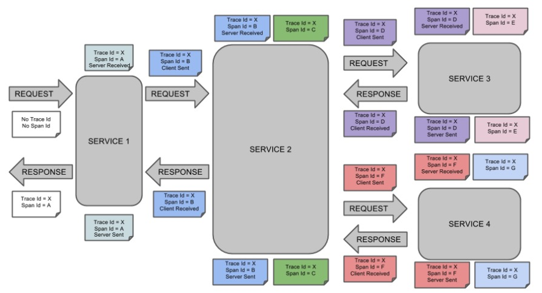
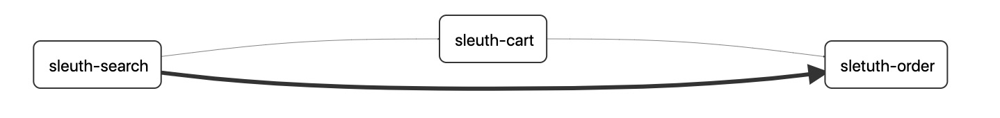
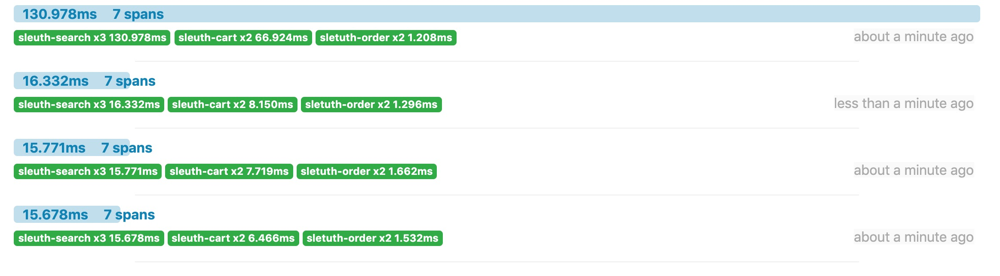
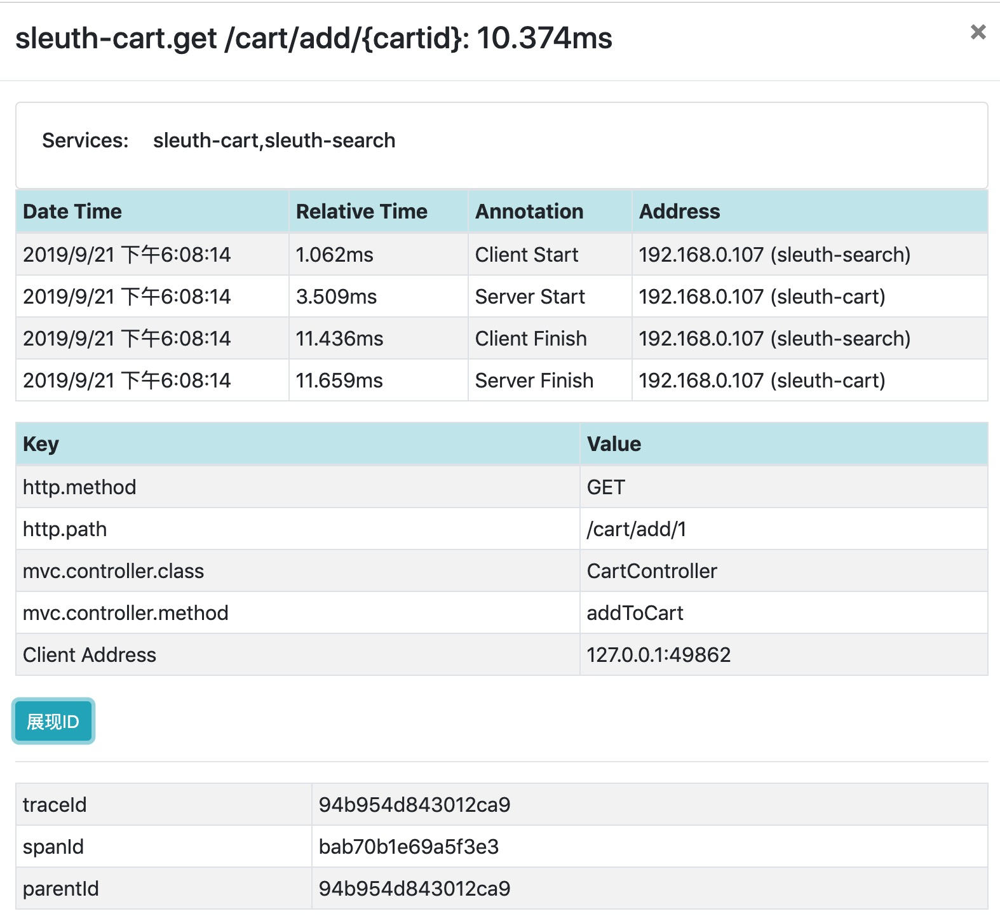
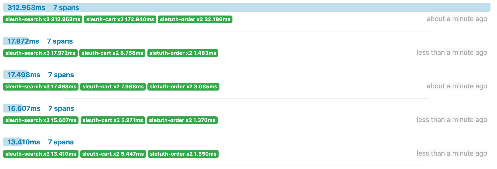

## SpringCloud Sleuth 简介

Spring Cloud Sleuth为Spring Cloud实现了分布式跟踪解决方案。

Spring Cloud Sleuth借鉴了Dapper的术语。

**Span**：基本的工作单元。Span包括一个64位的唯一ID，一个64位trace码，描述信息，时间戳事件，key-value 注解(tags)，span处理者的ID（通常为IP）。

**Trace**：一组Span形成的树形结构。

**Annotation**：用于及时记录存在的事件。常用的Annotation如下：

+ cs：客户端发送(client send) 客户端发起一个请求，表示span开始
+ sr：服务器接收(server received) 服务器接收到客户端的请求并开始处理，sr - cs 的时间为网络延迟
+ ss：服务器发送(server send)  服务器处理完请求准备返回数据给客户端。ss - sr 的时间表示服务器端处理请求花费的时间
+ cr：客户端接收(client received) 客户端接收到处理结果，表示span结束。 cr - cs 的时间表示客户端接收服务端数据的时间

下图展示了Span和Trace在系统中的联系




### SpringCloud Sleuth 默认采用 Http 方式将 span 信息传输给 Zipkin

在application.properties文件中指定

```properties
spring.zipkin.sender.type=web
```


### 使用 RabbitMQ 异步发送 span 信息

**为什么选择 RabbitMQ 消息中间件发送 span 信息**

- sleuth 默认采用 http 通信方式，将数据传给 zipkin 作页面渲染，但是 http 传输过程中如果由于不可抗因素导致 http 通信中断，那么此次通信的数据将会丢失。而使用中间件的话，RabbitMQ 消息队列可以积压千万级别的消息，下次重连之后可以继续消费。
- 随着线程增多，并发量提升之后，RabbitMQ 异步发送数据明显更具有优势。
- RabbitMQ 支持消息、队列持久化，可以通过消息状态落库、重回队列、镜像队列等技术手段保证其高可用。


## 示例

### 示例简介

示例包含sleuth-search、sleuth-cart、sleuth-order三个系统，用来模拟电商系统中下单的流程，用户可以搜索商品然后立即下单，也可以搜索多个商品后加入购物车，然后下单，调用情况即 search -> cart -> order，或 search -> order。

示例使用 `RestTemplate` 来完成三个系统间的 `http` 请求响应，请求方式也都遵循`Restful`风格。


### 版本说明

版本一定要对应好，一些低版本的SpringBoot无法兼容新版本的SpringCloud和zipkin

| 工具        | 版本          |
| ----------- | ------------- |
| SpringBoot  | 2.1.6.RELEASE |
| SpringCloud | Greenwich.SR3 |
| zipkin      | 2.16.2        |


### 项目结构

```
demo-cloudsleuth
	|- sleuth-search
	|- sleuth-cart
	|- sleuth-order
	pom.xml
```


### 导入依赖

```xml
    <!-- 引入 springboot 和 springcloud 父工程 -->
    <parent>
        <groupId>org.springframework.boot</groupId>
        <artifactId>spring-boot-starter-parent</artifactId>
        <version>2.1.6.RELEASE</version>
        <relativePath/>
    </parent>
    <dependencyManagement>
        <dependencies>
            <dependency>
                <groupId>org.springframework.cloud</groupId>
                <artifactId>spring-cloud-dependencies</artifactId>
                <version>Greenwich.SR3</version>
                <type>pom</type>
                <scope>import</scope>
            </dependency>
        </dependencies>
    </dependencyManagement>

    <dependencies>
        <dependency>
            <groupId>org.springframework.cloud</groupId>
            <artifactId>spring-cloud-starter-zipkin</artifactId>
        </dependency>
        <dependency>
            <groupId>org.springframework.amqp</groupId>
            <artifactId>spring-rabbit</artifactId>
        </dependency>
        <!-- Springboot 相关 -->
        <dependency>
            <groupId>org.springframework.boot</groupId>
            <artifactId>spring-boot-starter-web</artifactId>
        </dependency>
        <dependency>
            <groupId>org.springframework.boot</groupId>
            <artifactId>spring-boot-starter-test</artifactId>
            <scope>test</scope>
        </dependency>
    </dependencies>
```

配置 RestTemplate，RestTemplate是SpringBoot提供的封装好的http工具类，可以帮助我们简化http的使用。

```java
package com.anqi.cart.resttmplate;

import org.springframework.context.annotation.Bean;
import org.springframework.context.annotation.Configuration;
import org.springframework.http.client.ClientHttpRequestFactory;
import org.springframework.http.client.SimpleClientHttpRequestFactory;
import org.springframework.web.client.RestTemplate;

@Configuration
public class RestTemplateConfig {
    @Bean
    public RestTemplate restTemplate(ClientHttpRequestFactory factory) {
        return new RestTemplate(factory);
    }

    @Bean
    public ClientHttpRequestFactory clientHttpRequestFactory() {
        SimpleClientHttpRequestFactory factory = new SimpleClientHttpRequestFactory();
        factory.setConnectTimeout(5000);
        factory.setReadTimeout(5000);
        return factory;
    }
}
```

三个系统下的application.properties，端口分别是8081 8082 8083

```properties
#server.port=8081 server.port=8082
server.port=8083 
server.servlet.context-path=/

spring.zipkin.base-url=http://localhost:9411/
spring.zipkin.service.name=sleuth-cart

#使用默认 http 方式收集 span 需要配置此项
#spring.zipkin.sender.type=web

#sleuth 使用 rabbitmq 来向 zipkin 发送数据
spring.zipkin.sender.type=rabbit
spring.rabbitmq.host=localhost
spring.rabbitmq.port=5672
spring.rabbitmq.username=guest
spring.rabbitmq.password=guest

#设置采样率默认为 0.1 注意之前的版本是percentage 新版本中更换为 probability
spring.sleuth.sampler.probability=1
```

三个系统下的RestTemplate的配置，用来简化 http 请求

```java
package com.anqi.cart.resttmplate;

import org.springframework.context.annotation.Bean;
import org.springframework.context.annotation.Configuration;
import org.springframework.http.client.ClientHttpRequestFactory;
import org.springframework.http.client.SimpleClientHttpRequestFactory;
import org.springframework.web.client.RestTemplate;

@Configuration
public class RestTemplateConfig {
    @Bean
    public RestTemplate restTemplate(ClientHttpRequestFactory factory) {
        return new RestTemplate(factory);
    }

    @Bean
    public ClientHttpRequestFactory clientHttpRequestFactory() {
        SimpleClientHttpRequestFactory factory = new SimpleClientHttpRequestFactory();
        factory.setConnectTimeout(5000);
        factory.setReadTimeout(5000);
        return factory;
    }
}
```


```java
@RequestMapping("cart")
@RestController
public class CartController {
    @Autowired
    RestTemplate restTemplate;
    @Autowired
    CartService cartService;
    private static final String orderUrl = "http://localhost:8084/order/create";

    @GetMapping("/add/{cartId}")
    public String addToCart(@PathVariable("cartId") String cartId) {
        cartService.addProductToCart(cartId, "小米8");
        ResponseEntity<String> res = restTemplate.getForEntity(orderUrl, String.class);
        return res.getBody();
    }
}
```


```java
@RequestMapping("order")
@RestController
public class OrderController {
    @GetMapping("/create")
    public String creatOrder() {
        System.out.println("create order");
        return "create_order";
    }
}
```


```java
@RestController
public class SearchController {
    @Autowired
    RestTemplate restTemplate;

    private static final String cartUrl = "http://localhost:8083/cart/add/1";
    private static final String orderUrl = "http://localhost:8084/order/create";

    @GetMapping("/search")
    public String search() {
        ResponseEntity<String> cartRes = restTemplate.getForEntity(cartUrl, String.class);
        ResponseEntity<String> orderRes = restTemplate.getForEntity(orderUrl, String.class);
        return "cart:" + cartRes.getBody() + "- order:" + orderRes.getBody();

    }
}
```


## 运行结果分析

### 默认 http 传输 span 信息

启动`Zipkin`

```
java -jar zipkin-server-2.16.2-exec.jar
```

网页中手动访问

```http
http://localhost:8082/search
```

我们访问zipkin站点查询调用情况

```http
http://localhost:9411/zipkin/traces/94b954d843012ca9
```

可以从下图中完整清晰的看到三个系统的调用关系



下图为zipkin调用预览，我们请求四次`http://localhost:8082/search`来更直观的观察数据。在以下界面中，较为简洁的显示Span的个数以及调用总时延。



我们进入一个完整的调用链后访问其中的一个节点得到以下数据。



以下为一次全链路追踪的详细信息，包含7个span的所有信息，以上看到的页面展示均有以下数据加以渲染而成。

```
[
  {
    "traceId": "94b954d843012ca9",
    "parentId": "bab70b1e69a5f3e3",
    "id": "96387b33a823ca8f",
    "kind": "SERVER",
    "name": "get /order/create",
    "timestamp": 1569060494069123,
    "duration": 1161,
    "localEndpoint": {
      "serviceName": "sletuth-order",
      "ipv4": "192.168.0.107"
    },
    "remoteEndpoint": {
      "ipv4": "127.0.0.1",
      "port": 49863
    },
    "tags": {
      "http.method": "GET",
      "http.path": "/order/create",
      "mvc.controller.class": "OrderController",
      "mvc.controller.method": "creatOrder"
    },
    "shared": true
  },
  {
    "traceId": "94b954d843012ca9",
    "parentId": "94b954d843012ca9",
    "id": "90f7e5cfa89e0d80",
    "kind": "SERVER",
    "name": "get /order/create",
    "timestamp": 1569060494076287,
    "duration": 1296,
    "localEndpoint": {
      "serviceName": "sletuth-order",
      "ipv4": "192.168.0.107"
    },
    "remoteEndpoint": {
      "ipv4": "127.0.0.1",
      "port": 49864
    },
    "tags": {
      "http.method": "GET",
      "http.path": "/order/create",
      "mvc.controller.class": "OrderController",
      "mvc.controller.method": "creatOrder"
    },
    "shared": true
  },
  {
    "traceId": "94b954d843012ca9",
    "parentId": "94b954d843012ca9",
    "id": "bab70b1e69a5f3e3",
    "kind": "CLIENT",
    "name": "get",
    "timestamp": 1569060494063693,
    "duration": 10374,
    "localEndpoint": {
      "serviceName": "sleuth-search",
      "ipv4": "192.168.0.107"
    },
    "tags": {
      "http.method": "GET",
      "http.path": "/cart/add/1"
    }
  },
  {
    "traceId": "94b954d843012ca9",
    "parentId": "94b954d843012ca9",
    "id": "90f7e5cfa89e0d80",
    "kind": "CLIENT",
    "name": "get",
    "timestamp": 1569060494074966,
    "duration": 2848,
    "localEndpoint": {
      "serviceName": "sleuth-search",
      "ipv4": "192.168.0.107"
    },
    "tags": {
      "http.method": "GET",
      "http.path": "/order/create"
    }
  },
  {
    "traceId": "94b954d843012ca9",
    "id": "94b954d843012ca9",
    "kind": "SERVER",
    "name": "get /search",
    "timestamp": 1569060494062631,
    "duration": 16332,
    "localEndpoint": {
      "serviceName": "sleuth-search",
      "ipv4": "192.168.0.107"
    },
    "remoteEndpoint": {
      "ipv6": "::1",
      "port": 49859
    },
    "tags": {
      "http.method": "GET",
      "http.path": "/search",
      "mvc.controller.class": "SearchController",
      "mvc.controller.method": "search"
    }
  },
  {
    "traceId": "94b954d843012ca9",
    "parentId": "bab70b1e69a5f3e3",
    "id": "96387b33a823ca8f",
    "kind": "CLIENT",
    "name": "get",
    "timestamp": 1569060494067090,
    "duration": 3197,
    "localEndpoint": {
      "serviceName": "sleuth-cart",
      "ipv4": "192.168.0.107"
    },
    "tags": {
      "http.method": "GET",
      "http.path": "/order/create"
    }
  },
  {
    "traceId": "94b954d843012ca9",
    "parentId": "94b954d843012ca9",
    "id": "bab70b1e69a5f3e3",
    "kind": "SERVER",
    "name": "get /cart/add/{cartid}",
    "timestamp": 1569060494066140,
    "duration": 8150,
    "localEndpoint": {
      "serviceName": "sleuth-cart",
      "ipv4": "192.168.0.107"
    },
    "remoteEndpoint": {
      "ipv4": "127.0.0.1",
      "port": 49862
    },
    "tags": {
      "http.method": "GET",
      "http.path": "/cart/add/1",
      "mvc.controller.class": "CartController",
      "mvc.controller.method": "addToCart"
    },
    "shared": true
  }
]
```


### 使用 RabbitMQ 情况

启动 zipkin，注意参数

```
java -jar zipkin-server-2.16.2-exec.jar --RABBIT_ADDRESSES=localhost:5672 --RABBIT_USER=guest --RABBIT_PASSWORD=guest --RABBIT_VIRTUAL_HOST=/
```

启动 rabbitmq

```
rabbitmq-server
```

在测试的时候发现 mq 和以上方式时延相差无几，但是随着线程数的增加也就是并发量的增加，mq 传输时延将会大大低于 http。

